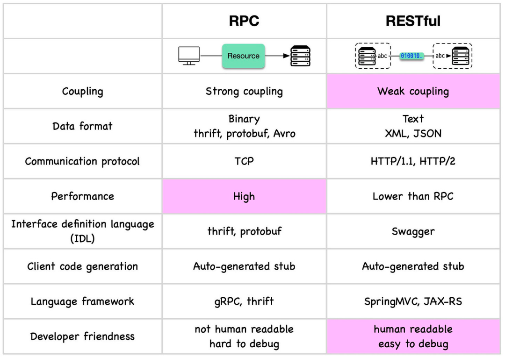
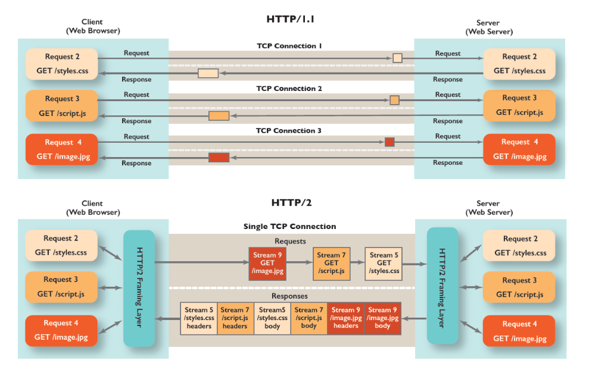
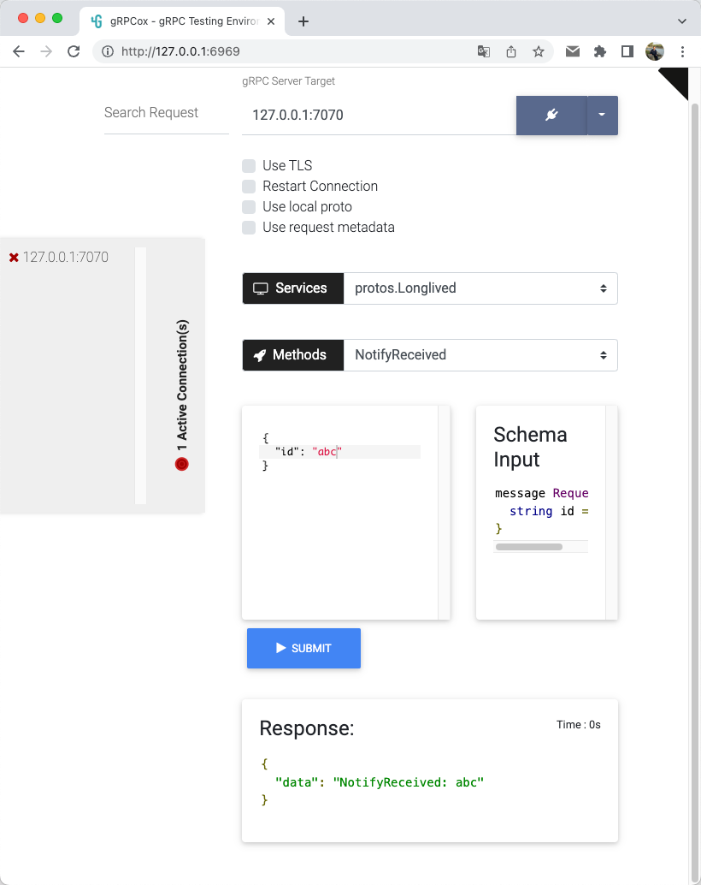
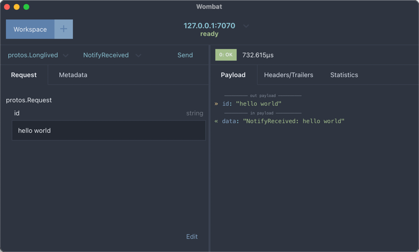

# gRPC Long-lived Streaming

This repository fork from [this repo](https://github.com/omri86/longlived-grpc) holds a minimalistic example of a gRPC
long-lived streaming application.

## 先简单介绍一下 pb, Protocol Buffers（protobuf）

它是Google开发的一种数据序列化协议（与XML、JSON类似）。它具有很多优点，但也有一些需要注意的缺点：

优点：

1. 效率高：Protobuf以二进制格式存储数据，比如XML和JSON等文本格式更紧凑，也更快。序列化和反序列化的速度也很快。
2. 跨语言支持：Protobuf支持多种编程语言，包括C++、Java、Python等。
3. 清晰的结构定义：使用protobuf，可以清晰地定义数据的结构，这有助于维护和理解。
4. 向后兼容性：你可以添加或者删除字段，而不会破坏老的应用程序。这对于长期的项目来说是非常有价值的。

缺点：

1. 不直观：由于protobuf是二进制格式，人不能直接阅读和修改它。这对于调试和测试来说可能会有些困难。
2. 缺乏一些数据类型：例如没有内建的日期、时间类型，对于这些类型的数据，需要手动转换成可以支持的类型，如string或int。
3. 需要额外的编译步骤：你需要先定义数据结构，然后使用protobuf的编译器将其编译成目标语言的代码，这是一个额外的步骤，可能会影响开发流程。

## Resources

1. [配图清新的Protobuf 编码&避坑指南](https://mp.weixin.qq.com/s/7zkuWumtvJs3cLtj_JGCNw)
2. [grpc-go, a gRPC client-side load balancing example](https://github.com/grpc/grpc-go)
3. [gRPC客户端的那些事儿](https://tonybai.com/2021/09/17/those-things-about-grpc-client/)
4. [blog grpc-long-lived-streaming](https://dev.bitolog.com/grpc-long-lived-streaming/)
5. [gRPC is easy to misconfigure](https://www.evanjones.ca/grpc-is-tricky.html)
    - Client keepalive is dangerous: do not use it
    - Servers cannot return errors larger than 7 kiB
6. [gRPC-中使用-Channel](https://helloworlde.github.io/2021/01/04/gRPC-中使用-Channelz/)

### gRPC支持四种通信模式

gRPC支持四种通信模式，它们是: 截自 [《gRPC: Up and Running》一书](https://book.douban.com/subject/34796013/)：

[java-grpc-examples](./java-grpc-example/README.MD)


图[来自](https://towardsdev.com/4-types-of-grpc-apis-with-go-and-java-example-dc4db630fc83)

1. 简单RPC(Simple RPC)：最简单的，也是最常用的 gRPC 通信模式，简单来说就是一请求一应答
   
2. 服务端流RPC(Server-streaming RPC)：一请求，多应答
   
3. 客户端流RPC(Client-streaming RPC)：多请求，一应答
   
4. 双向流RPC(Bidirectional-Streaming RPC)：多请求，多应答
   

## a little comparison with REST API

| REST                           | gRPC             |
|--------------------------------|------------------|
| JSON                           | Protocol Buffers |
| HTTP 1.1                       | HTTP 2.0         |
| Unary (request response model) | Streaming        |
| Client -> Server               | Bi Directional   |
| GET/POST/PUT/DELETE ...        | Free Design      |



图来自[如何在RPC和RESTful之间做选择？](https://mp.weixin.qq.com/s/CLujYyU_KfHAbKjXdaiorw)

[A detailed comparison of REST and gRPC](https://kreya.app/blog/rest-vs-grpc/)

| Topic               | REST                          | gRPC                                                                  |
|---------------------|-------------------------------|-----------------------------------------------------------------------|
| Standardization     | No standard                   | Well defined                                                          |
| Paradigm            | Resource based                | RPC                                                                   |
| Service modes       | Only unary                    | Unary, client streaming, server streaming and bidirectional streaming |
| Requirements        | Any HTTP version, JSON parser | HTTP/2, gRPC implementation for language                              |
| API design          | Code first                    | Design first                                                          |
| Default data format | JSON                          | Protobuf                                                              |
| Web browser support | Native                        | gRPC web, via workarounds                                             |
| Tools               | More established tools        | Language support varies, some with excellent implementations          |

## HTTP 2.0 (h2) features

### Multiplexing

Client makes multiple requests in the single TCP connection. The Server will respond to the request by the use of Stream
ID which is unique for each request in the same connection.



### Compression (Headers & Data)

Multiplexing makes the HTTP 2 to compress the headers. In HTTP 1.1 we can compress the data but the headers are used to
identify the request so the Headers are not compressed but in HTTP 2 we can identify the request with the help of Stream
ID, so we can compress the headers.

### Server Push — HTTP/2 with push (this is not enabled by default)

Configuring the Server smart enough to push all the needed files when the Client request for one file. Simply, make the
Server to push all the files related to the file requested by the Client.

Note: Also need to configure the Clients to receive the multiple responses for the single request.

### Secure by default

HTTP 2 in short h2 uses TLS encryption by default.

## Prequirements

- [protoc](https://github.com/google/protobuf)
- [protoc-gen-go](https://github.com/golang/protobuf/tree/master/protoc-gen-go)
    - `$ go get -u github.com/golang/protobuf/protoc-gen-go`

## Instructions

1. To compile the proto file, run `make protoc`
2. To install, run `make install`

Note that this was tested on protoc version: `libprotoc 3.17.3`

## Running the server

```sh
$ longlivedgrpc -v --addr :7070,:7080,:7090 -mode server
2022-04-23 16:12:08.036 [INFO ] 52620 --- [1    ] [-]  : log file created: /Users/bingoo/logs/longlived-grpc/longlived-grpc.log
2022-04-23 16:12:08.037 [INFO ] 52620 --- [20   ] [-]  : Starting mock data generation
2022-04-23 16:12:08.037 [INFO ] 52620 --- [24   ] [-]  : Starting mock data generation
2022-04-23 16:12:08.037 [INFO ] 52620 --- [26   ] [-]  : ListenAndServe rest server at :7170
2022-04-23 16:12:08.037 [INFO ] 52620 --- [22   ] [-]  : Starting mock data generation
2022-04-23 16:12:08.038 [INFO ] 52620 --- [25   ] [-]  : Starting server on address [::]:7090
2022-04-23 16:12:08.038 [INFO ] 52620 --- [23   ] [-]  : Starting server on address [::]:7080
2022-04-23 16:12:08.038 [INFO ] 52620 --- [21   ] [-]  : Starting server on address [::]:7070
2022-04-23 16:14:35.357 [WARN ] 52620 --- [30   ] [1517778949952770048]  : 127.0.0.1 GET /client/start [404] -1  gurl/1.0.0 (406ns)
2022-04-23 16:15:14.933 [INFO ] 52620 --- [98   ] [-]  : Received subscribe request from ID: 28BtH1SSTqKzGqzRlznboTGQZY7
2022-04-23 16:15:15.207 [INFO ] 52620 --- [57   ] [-]  : NotifyReceived: 28BtH1SSTqKzGqzRlznboTGQZY7
2022-04-23 16:15:16.209 [INFO ] 52620 --- [99   ] [-]  : NotifyReceived: 28BtH1SSTqKzGqzRlznboTGQZY7
2022-04-23 16:15:17.209 [INFO ] 52620 --- [69   ] [-]  : NotifyReceived: 28BtH1SSTqKzGqzRlznboTGQZY7
2022-04-23 16:15:18.211 [INFO ] 52620 --- [70   ] [-]  : NotifyReceived: 28BtH1SSTqKzGqzRlznboTGQZY7
2022-04-23 16:15:19.210 [INFO ] 52620 --- [71   ] [-]  : NotifyReceived: 28BtH1SSTqKzGqzRlznboTGQZY7
2022-04-23 16:15:24.628 [INFO ] 52620 --- [98   ] [-]  : Client ID 28BtH1SSTqKzGqzRlznboTGQZY7 has disconnected
2022-04-23 16:15:25.214 [INFO ] 52620 --- [22   ] [-]  : Failed to send data to client: rpc error: code = Canceled desc = context canceled
2022-04-23 16:15:34.713 [INFO ] 52620 --- [101  ] [-]  : NotifyReceived: 28BtJSzb2buZxWPv8dmx2ya4IqK
```

## Running the client(s)

```sh
$ longlivedgrpc -v --addr :7070,:7080,:7090 -mode client -p 7270
2022-04-23 16:24:41.575 [INFO ] 53744 --- [1    ] [-]  : log file created: /Users/bingoo/logs/longlived-grpc/longlived-grpc.log
2022-04-23 16:24:41.575 [INFO ] 53744 --- [1    ] [-]  : static resolver: :7070,:7080,:7090
2022-04-23 16:24:41.575 [INFO ] 53744 --- [1    ] [-]  : static resolved: [localhost:7070 localhost:7080 localhost:7090]
2022-04-23 16:24:41.576 [INFO ] 53744 --- [24   ] [-]  : ListenAndServe rest server at :7270
2022-04-23 16:24:48.478 [INFO ] 53744 --- [68   ] [1517781521828679680]  : 127.0.0.1 GET /client/start [200] 111  gurl/1.0.0 (64.391µs)
2022-04-23 16:24:48.478 [INFO ] 53744 --- [70   ] [-]  : Subscribing client ID 28BuR6tGDmISx8OveFGpk2HwXfE
2022-04-23 16:24:48.478 [INFO ] 53744 --- [71   ] [-]  : Subscribing client ID 28BuR9Ocl02Xlmnvhk8ZPcjD7RE
2022-04-23 16:24:48.553 [INFO ] 53744 --- [71   ] [-]  : Client ID 28BuR9Ocl02Xlmnvhk8ZPcjD7RE got response: "data mock for: 28BuR9Ocl02Xlmnvhk8ZPcjD7RE"
2022-04-23 16:24:48.553 [INFO ] 53744 --- [70   ] [-]  : Client ID 28BuR6tGDmISx8OveFGpk2HwXfE got response: "data mock for: 28BuR6tGDmISx8OveFGpk2HwXfE"
2022-04-23 16:24:49.554 [INFO ] 53744 --- [71   ] [-]  : Client ID 28BuR9Ocl02Xlmnvhk8ZPcjD7RE got response: "data mock for: 28BuR9Ocl02Xlmnvhk8ZPcjD7RE"
2022-04-23 16:24:49.554 [INFO ] 53744 --- [70   ] [-]  : Client ID 28BuR6tGDmISx8OveFGpk2HwXfE got response: "data mock for: 28BuR6tGDmISx8OveFGpk2HwXfE"
2022-04-23 16:24:50.555 [INFO ] 53744 --- [71   ] [-]  : Client ID 28BuR9Ocl02Xlmnvhk8ZPcjD7RE got response: "data mock for: 28BuR9Ocl02Xlmnvhk8ZPcjD7RE"
2022-04-23 16:24:50.555 [INFO ] 53744 --- [70   ] [-]  : Client ID 28BuR6tGDmISx8OveFGpk2HwXfE got response: "data mock for: 28BuR6tGDmISx8OveFGpk2HwXfE"
2022-04-23 16:24:51.556 [INFO ] 53744 --- [71   ] [-]  : Client ID 28BuR9Ocl02Xlmnvhk8ZPcjD7RE got response: "data mock for: 28BuR9Ocl02Xlmnvhk8ZPcjD7RE"
2022-04-23 16:24:51.556 [INFO ] 53744 --- [70   ] [-]  : Client ID 28BuR6tGDmISx8OveFGpk2HwXfE got response: "data mock for: 28BuR6tGDmISx8OveFGpk2HwXfE"
2022-04-23 16:24:52.557 [INFO ] 53744 --- [70   ] [-]  : Client ID 28BuR6tGDmISx8OveFGpk2HwXfE got response: "data mock for: 28BuR6tGDmISx8OveFGpk2HwXfE"
2022-04-23 16:24:59.545 [INFO ] 53744 --- [72   ] [1517781568247042048]  : Unsubscribe client ID: 28BuR6tGDmISx8OveFGpk2HwXfE
2022-04-23 16:24:59.545 [INFO ] 53744 --- [72   ] [1517781568247042048]  : unsubscribe successfully, response:
2022-04-23 16:24:59.546 [INFO ] 53744 --- [72   ] [1517781568247042048]  : 127.0.0.1 GET /client/stop [200] 93  gurl/1.0.0 (826.985µs)
2022-04-23 16:24:59.546 [INFO ] 53744 --- [70   ] [-]  : stream is finished: EOF
2022-04-23 16:24:59.546 [INFO ] 53744 --- [70   ] [-]  : Client ID 28BuR6tGDmISx8OveFGpk2HwXfE exited
2022-04-23 16:24:59.563 [INFO ] 53744 --- [71   ] [-]  : Client ID 28BuR9Ocl02Xlmnvhk8ZPcjD7RE got response: "data mock for: 28BuR9Ocl02Xlmnvhk8ZPcjD7RE"
2022-04-23 16:25:00.563 [INFO ] 53744 --- [71   ] [-]  : Client ID 28BuR9Ocl02Xlmnvhk8ZPcjD7RE got response: "data mock for: 28BuR9Ocl02Xlmnvhk8ZPcjD7RE"
2022-04-23 16:25:01.563 [INFO ] 53744 --- [71   ] [-]  : Client ID 28BuR9Ocl02Xlmnvhk8ZPcjD7RE got response: "data mock for: 28BuR9Ocl02Xlmnvhk8ZPcjD7RE"
2022-04-23 16:25:08.500 [INFO ] 53744 --- [37   ] [1517781605802840064]  : Unsubscribe client ID: 28BuR9Ocl02Xlmnvhk8ZPcjD7RE
2022-04-23 16:25:08.501 [INFO ] 53744 --- [37   ] [1517781605802840064]  : unsubscribe successfully, response:
2022-04-23 16:25:08.501 [INFO ] 53744 --- [37   ] [1517781605802840064]  : 127.0.0.1 GET /client/stop [200] 93  gurl/1.0.0 (1.169235ms)
2022-04-23 16:25:08.501 [INFO ] 53744 --- [71   ] [-]  : stream is finished: EOF
2022-04-23 16:25:08.501 [INFO ] 53744 --- [71   ] [-]  : Client ID 28BuR9Ocl02Xlmnvhk8ZPcjD7RE exited
2022-04-23 16:25:32.911 [INFO ] 53744 --- [90   ] [1517781708189995008]  : peer.Addr: [tcp] [::1]:7090
2022-04-23 16:25:32.913 [INFO ] 53744 --- [90   ] [1517781708189995008]  : peer.Addr: [tcp] [::1]:7070
2022-04-23 16:25:32.913 [INFO ] 53744 --- [90   ] [1517781708189995008]  : peer.Addr: [tcp] [::1]:7080
2022-04-23 16:25:32.914 [INFO ] 53744 --- [90   ] [1517781708189995008]  : peer.Addr: [tcp] [::1]:7090
2022-04-23 16:25:32.915 [INFO ] 53744 --- [90   ] [1517781708189995008]  : 127.0.0.1 GET /client/notify [200] 264  gurl/1.0.0 (3.779777ms)
```

## use client rest APIs

```sh
$ gurl :7270/client/start -pb -r
{"status":200,"message":"OK","data":{"clientID":"28Bu5TlPfDD7vf5e0D9lFC6jcep"}}

$ gurl :7270/client/stop id==28Bu5TlPfDD7vf5e0D9lFC6jcep -pb -r
{"status":200,"message":"stop and deleted","data":{"clientID":"28Bu5TlPfDD7vf5e0D9lFC6jcep"}}

$ gurl :7270/client/start -pb -r n==2
{"status":200,"message":"OK","data":{"clientID":["28BuR6tGDmISx8OveFGpk2HwXfE","28BuR9Ocl02Xlmnvhk8ZPcjD7RE"]}}

$ gurl :7270/client/stop id==28BuR6tGDmISx8OveFGpk2HwXfE -pb -r
{"status":200,"message":"stop and deleted","data":{"clientID":"28BuR6tGDmISx8OveFGpk2HwXfE"}}

$ gurl :7270/client/stop id==28BuR9Ocl02Xlmnvhk8ZPcjD7RE -pb -r
{"status":200,"message":"stop and deleted","data":{"clientID":"28BuR9Ocl02Xlmnvhk8ZPcjD7RE"}}

$ gurl :7270/client/notify n==4 -pb -r
{"status":200,"message":"notified","data":[{"data":"NotifyReceived: 28BuWcYzElXkHt2pxQrUPPJVwds"},{"data":"NotifyReceived: 28BuWcIdNGGggWUEBBAKzxwEetS"},{"data":"NotifyReceived: 28BuWh22X8TT5de9PaV43veYIr9"},{"data":"NotifyReceived: 28BuWd57VUCQzHjExwIHYh9wQ7M"}]}
```

## multiple servers

1. server: `goreman start`
2. client: `longlived-grpc -mode client -addr ":7071,:7072,:7073" -v`

## grpc ui

1. ensure env `GRPC_REFLECTION` has not the value as any of `0`, `off`, `no`
2. install [grpcui](https://github.com/fullstorydev/grpcui)
3. start the server: `longlived-grpc`
4. start the grpcui: `grpcui -plaintext localhost:7070`

## HTTP REST API

### Server API list

1. `:7080/server/start` start the grpc server
2. `:7080/server/stop` stop the grpc server

### Client API list

1. `:7081/client/start` start a new grpc streaming call
2. `:7081/client/stop?id=xxx` stop an existing grpc streaming call, use id=all to stop all clients.
3. `:7081/client/list` list the existing grpc streaming calls
4. `:7081/client/notify` do an invoke notify grpc call

## channelzcli

1. ensure env `GRPC_CHANNELZ` has not the value as any of `0`, `off`, `no`
2. install channelzcli `go install github.com/bingoohuang/channelzcli@latest`
3. start longlived-grpc: `longlived-grpc`

```sh
$ gurl -pb -r :7080/client/start
{"status":200,"message":"OK","data":{"clientID":"26gv4BBtGfMMqSdeGADwUrwzMUH"}}
$ gurl -pb -r :7080/client/start
{"status":200,"message":"OK","data":{"clientID":"26gv4GDw4ZrCNH2vKtKRw0bNTvv"}}
$ channelzcli -k --addr localhost:7070 list channel
ID	Name                                                                            	State	Channel	SubChannel	Calls	Success	Fail	LastCall
2	127.0.0.1:7070                                                                  	READY	0      	1         	191   	188   	0     	639ms
$ channelzcli -k --addr localhost:7070 list serversocket
ID	ServerID	Name                                    	RemoteName          	Local               	Remote              	Started	Success	Fail	LastStream
6	1       	127.0.0.1:49171 -> 127.0.0.1:7070       	<none>              	[127.0.0.1]:7070	[127.0.0.1]:49171	206   	203   	0     	411ms
23	1       	[::1]:49657 -> [::1]:7070               	<none>              	[::1]:7070      	[::1]:49657     	4     	3     	0     	2ms
$ gurl -pb -r :7080/client/start
{"status":200,"message":"OK","data":{"clientID":"26gv7JBDIXPEp36BtGJNBRfsRKs"}}
$ channelzcli -k --addr localhost:7070 list server
ID	Name	LocalAddr	Calls	Success	Fail	LastCall
1	<none>	[::]:7070   	8     	6     	0     	0ms
$ channelzcli -k --addr localhost:7070 list serversocket
ID	ServerID	Name                                    	RemoteName          	Local               	Remote              	Started	Success	Fail	LastStream
6	1       	127.0.0.1:49661 -> 127.0.0.1:7070       	<none>              	[127.0.0.1]:7070	[127.0.0.1]:49661	10    	9     	0     	642ms
8	1       	[::1]:49673 -> [::1]:7070               	<none>              	[::1]:7070      	[::1]:49673     	4     	3     	0     	1ms
$ channelzcli -k --addr localhost:7070 list channel
ID	Name                                                                            	State	Channel	SubChannel	Calls	Success	Fail	LastCall
2	127.0.0.1:7070                                                                  	READY	0      	1         	24    	23    	0     	739ms
$ channelzcli -k --addr localhost:7070 describe server 1
ID: 	1
Name:
Calls:
  Started:        	49
  Succeeded:      	47
  Failed:         	0
  LastCallStarted:	2022-03-21 10:18:33.439509 +0000 UTC
$ channelzcli -k --addr localhost:7070 describe channel 2
ID:       	2
Name:     	127.0.0.1:7070
State:    	READY
Target:   	127.0.0.1:7070
Calls:
  Started:    	60
  Succeeded:  	59
  Failed:     	0
  LastCallStarted:	2022-03-21 10:18:52.151899 +0000 UTC
Socket:   	<none>
Channels:   	<none>
Subchannels:
  ID	Name	State	Start 	Succeeded	Failed
  3		READY	60    	59      	0
Trace:
  NumEvents:	13
  CreationTimestamp:	2022-03-21 10:17:50.107535 +0000 UTC
  Events
    Severity	Description                                                                     	Timestamp
    INFO	Channel Created                                                                 	2022-03-21 10:17:50.107634 +0000 UTC
    INFO	original dial target is: "127.0.0.1:7070"                                       	2022-03-21 10:17:50.107665 +0000 UTC
    INFO	dial target "127.0.0.1:7070" parse failed: parse "127.0.0.1:7070": first path segment in URL cannot contain colon	2022-03-21 10:17:50.107688 +0000 UTC
    INFO	fallback to scheme "passthrough"                                                	2022-03-21 10:17:50.10769 +0000 UTC
    INFO	parsed dial target is: {Scheme:passthrough Authority: Endpoint:127.0.0.1:7070 URL:{Scheme:passthrough Opaque: User: Host: Path:/127.0.0.1:7070 RawPath: ForceQuery:false RawQuery: Fragment: RawFragment:}}	2022-03-21 10:17:50.107763 +0000 UTC
    INFO	Channel authority set to "127.0.0.1:7070"                                       	2022-03-21 10:17:50.107768 +0000 UTC
    INFO	ccResolverWrapper: sending update to cc: {[{127.0.0.1:7070  <nil> <nil> 0 <nil>}] <nil> <nil>}	2022-03-21 10:17:50.107791 +0000 UTC
    INFO	Resolver state updated: {Addresses:[{Addr:127.0.0.1:7070 ServerName: Attributes:<nil> BalancerAttributes:<nil> Type:0 Metadata:<nil>}] ServiceConfig:<nil> Attributes:<nil>} (resolver returned new addresses)	2022-03-21 10:17:50.107801 +0000 UTC
    INFO	ClientConn switching balancer to "round_robin"                                  	2022-03-21 10:17:50.107809 +0000 UTC
    INFO	Channel switches to new LB policy "round_robin"                                 	2022-03-21 10:17:50.107812 +0000 UTC
    INFO	Subchannel(id:3) created                                                        	2022-03-21 10:17:50.107866 +0000 UTC
    INFO	Channel Connectivity change to CONNECTING                                       	2022-03-21 10:17:50.108088 +0000 UTC
    INFO	Channel Connectivity change to READY                                            	2022-03-21 10:17:50.108585 +0000 UTC
$ channelzcli -k --addr localhost:7070 describe serversocket 6
ID:       	6
Name:     	127.0.0.1:49661 -> 127.0.0.1:7070
Local:    	[127.0.0.1]:7070
Remote:   	[127.0.0.1]:49661
Streams:
  Started:    	90
  Succeeded:  	89
  Failed:     	0
  LastCreated:	2022-03-21 10:19:22.172461 +0000 UTC
Messages:
  Sent:    	178
  Recieved:  	90
  LastSent:	2022-03-21 10:19:22.172537 +0000 UTC
  LastReceived:	2022-03-21 10:19:22.172503 +0000 UTC
Options:
Security:
  Model: none
```

## grpc test tools

### Evans

[Evans](https://github.com/ktr0731/evans): more expressive universal gRPC client

known from [Github Repo](https://github.com/Djsmk123/wtf-is-grpc)
blog [Wtf is Grpc? Part 1: Authentication and Authorization in Flutter and Golang.](https://dev.to/djsmk123/wtf-is-grpc-part-1-authentication-and-authorization-in-flutter-and-golang-37jj),

```shell
$ evans --host localhost --port 2008 -r repl                                                                 

  ______
 |  ____|
 | |__    __   __   __ _   _ __    ___
 |  __|   \ \ / /  / _. | | '_ \  / __|
 | |____   \ V /  | (_| | | | | | \__ \
 |______|   \_/    \__,_| |_| |_| |___/

 more expressive universal gRPC client


SimpleService@localhost:2008> show service
+---------------+------------------------+---------------+----------------+
|    SERVICE    |          RPC           | REQUEST TYPE  | RESPONSE TYPE  |
+---------------+------------------------+---------------+----------------+
| SimpleService | RPCRequest             | SimpleRequest | SimpleResponse |
| SimpleService | ServerStreaming        | SimpleRequest | SimpleResponse |
| SimpleService | ClientStreaming        | SimpleRequest | SimpleResponse |
| SimpleService | StreamingBiDirectional | SimpleRequest | SimpleResponse |
+---------------+------------------------+---------------+----------------+

SimpleService@localhost:2008> call 
command call: argument required

SimpleService@localhost:2008> call RPCRequest
request_need (TYPE_STRING) => hello
request_id (TYPE_UINT64) => 123
{
  "response": "Here is your response",
  "responseId": "18446744073709551615"
}

SimpleService@localhost:2008> exit
Good Bye :)
$ 

```

### grpcurl

[fullstorydev/grpcurl](https://github.com/fullstorydev/grpcurl)

```sh
$ grpcurl -plaintext localhost:7070 grpc.channelz.v1.Channelz/GetServers
{
  "server": [
    {
      "ref": {
        "serverId": "1"
      },
      "data": {
        "callsStarted": "39",
        "callsSucceeded": "36",
        "lastCallStartedTimestamp": "2022-03-21T10:30:53.291282Z"
      },
      "listenSocket": [
        {
          "socketId": "5",
          "name": "[::]:7070"
        }
      ]
    }
  ],
  "end": true
}
$ grpcurl -plaintext localhost:7070 grpc.channelz.v1.Channelz/GetTopChannels
{
  "channel": [
    {
      "ref": {
        "channelId": "2",
        "name": "127.0.0.1:7070"
      },
      "data": {
        "state": {
          "state": "READY"
        },
        "target": "127.0.0.1:7070",
        "trace": {
          "numEventsLogged": "13",
          "creationTimestamp": "2022-03-21T10:30:10.666446Z",
          "events": [
            {
              "description": "Channel Created",
              "severity": "CT_INFO",
              "timestamp": "2022-03-21T10:30:10.666467Z"
            },
            {
              "description": "original dial target is: \"127.0.0.1:7070\"",
              "severity": "CT_INFO",
              "timestamp": "2022-03-21T10:30:10.666500Z"
            },
            {
              "description": "dial target \"127.0.0.1:7070\" parse failed: parse \"127.0.0.1:7070\": first path segment in URL cannot contain colon",
              "severity": "CT_INFO",
              "timestamp": "2022-03-21T10:30:10.666527Z"
            },
            {
              "description": "fallback to scheme \"passthrough\"",
              "severity": "CT_INFO",
              "timestamp": "2022-03-21T10:30:10.666529Z"
            },
            {
              "description": "parsed dial target is: {Scheme:passthrough Authority: Endpoint:127.0.0.1:7070 URL:{Scheme:passthrough Opaque: User: Host: Path:/127.0.0.1:7070 RawPath: ForceQuery:false RawQuery: Fragment: RawFragment:}}",
              "severity": "CT_INFO",
              "timestamp": "2022-03-21T10:30:10.666568Z"
            },
            {
              "description": "Channel authority set to \"127.0.0.1:7070\"",
              "severity": "CT_INFO",
              "timestamp": "2022-03-21T10:30:10.666573Z"
            },
            {
              "description": "ccResolverWrapper: sending update to cc: {[{127.0.0.1:7070  \u003cnil\u003e \u003cnil\u003e 0 \u003cnil\u003e}] \u003cnil\u003e \u003cnil\u003e}",
              "severity": "CT_INFO",
              "timestamp": "2022-03-21T10:30:10.666594Z"
            },
            {
              "description": "Resolver state updated: {Addresses:[{Addr:127.0.0.1:7070 ServerName: Attributes:\u003cnil\u003e BalancerAttributes:\u003cnil\u003e Type:0 Metadata:\u003cnil\u003e}] ServiceConfig:\u003cnil\u003e Attributes:\u003cnil\u003e} (resolver returned new addresses)",
              "severity": "CT_INFO",
              "timestamp": "2022-03-21T10:30:10.666604Z"
            },
            {
              "description": "ClientConn switching balancer to \"round_robin\"",
              "severity": "CT_INFO",
              "timestamp": "2022-03-21T10:30:10.666613Z"
            },
            {
              "description": "Channel switches to new LB policy \"round_robin\"",
              "severity": "CT_INFO",
              "timestamp": "2022-03-21T10:30:10.666615Z"
            },
            {
              "description": "Subchannel(id:3) created",
              "severity": "CT_INFO",
              "timestamp": "2022-03-21T10:30:10.666644Z",
              "subchannelRef": {
                "subchannelId": "3"
              }
            },
            {
              "description": "Channel Connectivity change to CONNECTING",
              "severity": "CT_INFO",
              "timestamp": "2022-03-21T10:30:10.666898Z"
            },
            {
              "description": "Channel Connectivity change to READY",
              "severity": "CT_INFO",
              "timestamp": "2022-03-21T10:30:10.668611Z"
            }
          ]
        },
        "callsStarted": "53",
        "callsSucceeded": "52",
        "lastCallStartedTimestamp": "2022-03-21T10:31:08.702486Z"
      },
      "subchannelRef": [
        {
          "subchannelId": "3"
        }
      ]
    }
  ],
  "end": true
}
```

### grpcox

[gusaul/grpcox](https://github.com/gusaul/grpcox)

Like Postman, but for gRPC: web based GUI client for gRPC Development Testing



### wombat

[wombat Cross platform gRPC client](https://github.com/rogchap/wombat)



## resources

1. [ptg 💥Performance testing tool (Go), It is also a GUI gRPC client.](https://github.com/crossoverJie/ptg)
2. [BloomRPC](https://github.com/bloomrpc/bloomrpc), electron GUI Client for RPC services，只能导入 protobuf .proto
   定义文件进行调用，没有反射功能
3. Cross platform gRPC GUI client [Forest33/warthog](https://github.com/Forest33/warthog)

## grpc

1. [grpc Quick start](https://grpc.io/docs/languages/go/quickstart/)