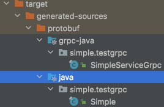

# Java Grpc Demo

## 代码生成

### 环境准备

下载插件

- [protoc](https://repo.maven.apache.org/maven2/com/google/protobuf/protoc/3.21.1/)
- [protoc-gen-grpc-java](https://repo.maven.apache.org/maven2/io/grpc/protoc-gen-grpc-java/1.49.0/)

1. protoc
    1. 创建 pom.xml

        ```xml
        <?xml version="1.0" encoding="UTF-8"?>
        <project xmlns="http://maven.apache.org/POM/4.0.0"
                  xmlns:xsi="http://www.w3.org/2001/XMLSchema-instance"
                  xsi:schemaLocation="http://maven.apache.org/POM/4.0.0 http://maven.apache.org/xsd/maven-4.0.0.xsd">
            <modelVersion>4.0.0</modelVersion>
            <groupId>com.google.protobuf</groupId>
            <artifactId>protoc</artifactId>
            <version>3.21.1</version>
        </project>
          ```

    2. mvn install

        ```shell
        mvn install:install-file -DgroupId=com.google.protobuf -DartifactId=protoc -Dversion=3.21.1 -Dclassifier=osx-x86_64 -Dpackaging=exe -Dfile=./protoc-3.21.1-osx-x86_64.exe
        ```

2. protoc-gen-grpc-java
    1. 创建 pom.xml

        ```xml
        <?xml version="1.0" encoding="UTF-8"?>
        <project xmlns="http://maven.apache.org/POM/4.0.0"
        xmlns:xsi="http://www.w3.org/2001/XMLSchema-instance"
        xsi:schemaLocation="http://maven.apache.org/POM/4.0.0 http://maven.apache.org/xsd/maven-4.0.0.xsd">
        <modelVersion>4.0.0</modelVersion>

        <groupId>io.grpc</groupId>
        <artifactId>protoc-gen-grpc-java</artifactId>
        <version>1.49.0</version>
        </project>
        ```

    2. mvn install

       ```shell
       mvn install:install-file -DgroupId=io.grpc -DartifactId=protoc-gen-grpc-java -Dversion=1.49.0 -Dclassifier=osx-x86_64 -Dpackaging=exe -Dfile=./protoc-gen-grpc-java-1.49.0-osx-x86_64.exe
       ```

### 生成

1. 在 `src/main/proto` 下创建 `xxxx.proto` 定义
2. 执行 `cd ./lib && mvn clean && mvn protobuf:compile && mvn protobuf:compile-custom`
3. target 目录下生成了 Java 代码



## server 端

启动 server

新启动一个 item tab, 执行以下命令：

```shell
mvn clean package && java -jar ./server/target/server-0.0.1-SNAPSHOT.jar
```

## client 端

启动 server

新启动一个 item tab, 执行以下命令：

```shell
mvn clean package && java -jar ./client/target/client-0.0.1-SNAPSHOT.jar
```

## Grpc 的 4 四种通信模式

### 简单RPC(Simple RPC)

简单RPC(Simple RPC)：最简单的，也是最常用的 gRPC 通信模式，简单来说就是一请求一应答

请求：

```shell
gurl :8080/client -pb
```

响应：

```json
{
  "key": 1808610206099736466,
  "value": "ACK :05msxdcrfnwgjvvf"
}

```

### 服务端流RPC(Server-streaming RPC)

服务端流RPC(Server-streaming RPC)：一请求，多应答

请求：

```shell
gurl :8080/client/serverStreaming -pb
```

响应：

```json
[
  {
    "key": -7610799730980299718,
    "value": "ACK : qcec95faayrf4dzn[0]"
  },
  {
    "key": -7610799730980299718,
    "value": "ACK : qcec95faayrf4dzn[1]"
  }
]
```

### 客户端流RPC(Client-streaming RPC)

客户端流RPC(Client-streaming RPC)：多请求，一应答

请求：

```shell
 gurl :8080/client/clientStreaming -pb
```

响应：

```json
{
  "key": 3,
  "value": "ACK :[1/3, 2/3, 3/3]"
}

```

### 双向流RPC(Bidirectional-Streaming RPC)

双向流RPC(Bidirectional-Streaming RPC)：多请求，多应答

请求：

```shell
gurl :8080/client/streamingBiDirectional -pb
```

响应：

```json
[
  {
    "key": 1,
    "value": "ACK : 请求原文 1/3 响应添加[0]"
  },
  {
    "key": 1,
    "value": "ACK : 请求原文 1/3 响应添加[1]"
  },
  {
    "key": 2,
    "value": "ACK : 请求原文 2/3 响应添加[0]"
  },
  {
    "key": 2,
    "value": "ACK : 请求原文 2/3 响应添加[1]"
  },
  {
    "key": 2,
    "value": "ACK : 请求原文 2/3 响应添加[2]"
  },
  {
    "key": 2,
    "value": "ACK : 请求原文 2/3 响应添加[3]"
  },
  {
    "key": 3,
    "value": "ACK : 请求原文 3/3 响应添加[0]"
  }
]
```

## 工具类

### 支持 grpc reflection

1. server 端引入依赖

    ```xml
    <dependency>
        <groupId>io.grpc</groupId>
        <artifactId>grpc-services</artifactId>
    </dependency>
    ```

1. server 启动时添加 `ProtoReflectionService` [server-reflection-tutorial](https://github.com/grpc/grpc-java/blob/master/documentation/server-reflection-tutorial.md#enable-server-reflection)

    ```java
    grpcServer=ServerBuilder.forPort(port)
      .addService(new SimpleImpl())
      .addService(ProtoReflectionService.newInstance())
      .build().start();
      log.info("Server started, listening on "+port);
    ```
